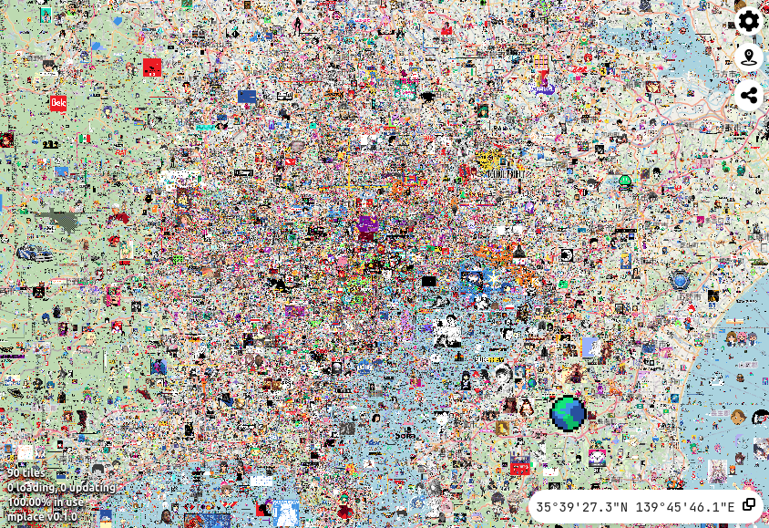
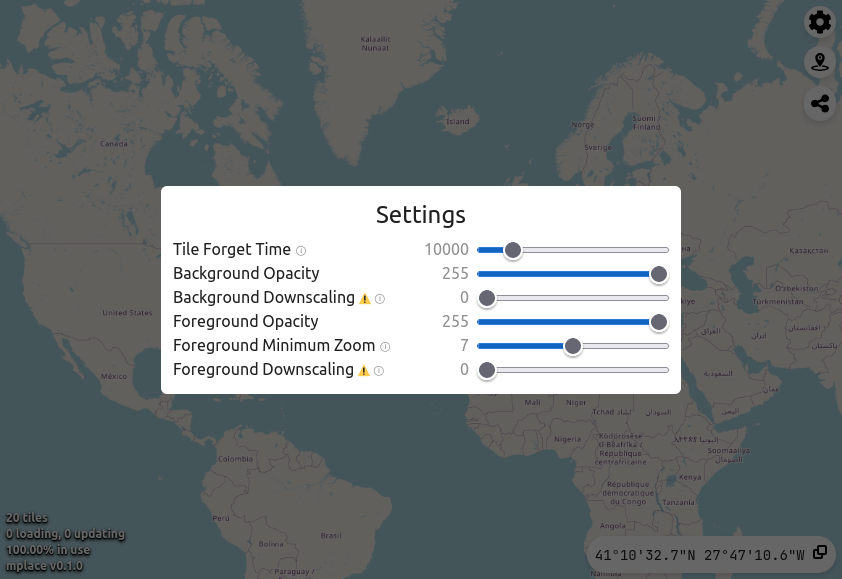
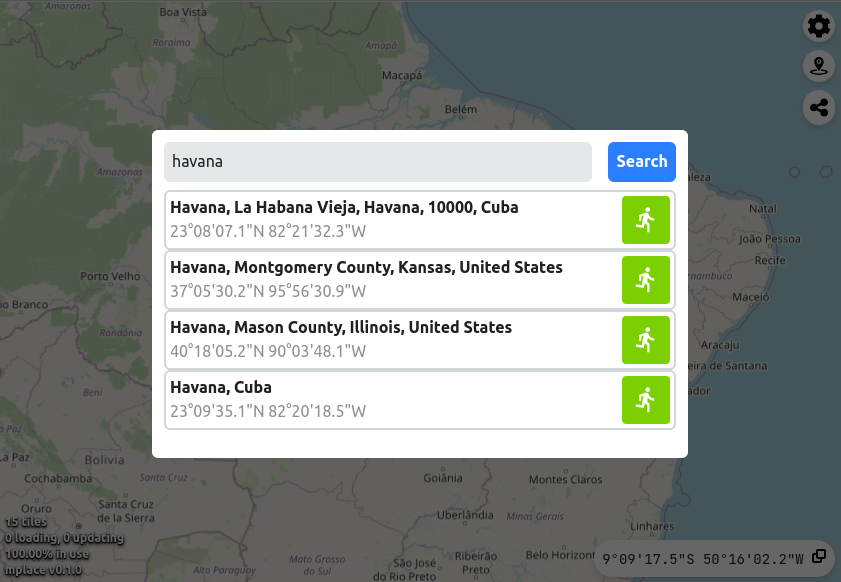

# mplace
An alternative read-only web client for [wplace](https://wplace.live/), the
earth-sized pixel canvas!

## Features
- Extensive rendering options, allowing very large areas to be loaded
- Fast travel powered by [Nominatim](https://nominatim.org/)
- Location sharing by URL
- Live coordinates display
- Extensive debugging info

## Roadmap
- Better UI/UX, mobile support
- Headful (app) mode for further optimizations
- Higher resolution background
- Configurable update intervals
- Svelte migration, possibly

## Gallery





## License
```text
   Copyright 2025 Xavier Pedraza

   Licensed under the Apache License, Version 2.0 (the "License");
   you may not use this file except in compliance with the License.
   You may obtain a copy of the License at

       http://www.apache.org/licenses/LICENSE-2.0

   Unless required by applicable law or agreed to in writing, software
   distributed under the License is distributed on an "AS IS" BASIS,
   WITHOUT WARRANTIES OR CONDITIONS OF ANY KIND, either express or implied.
   See the License for the specific language governing permissions and
   limitations under the License.
```
